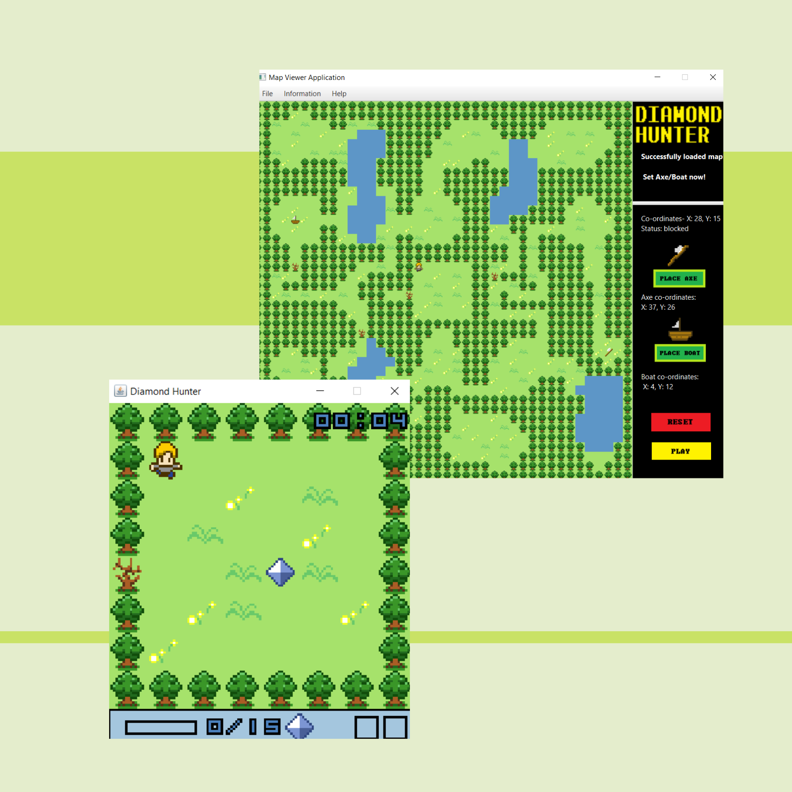

# Diamond Hunter Map Viewer
````
````

## Features 

* Map Viewer
  - whole map overview
  - reset map
  - play diamond hunter game
  
* Current Tile information Read-out
  - Blocked unblocked 
  - Currently placed item

* Item Placement
  - Axe
  - Boat

```
```

## In main game

Key: `UP, LEFT, DOWN, RIGHT` to move, `ENTER` to start the game, `SPACE` to clear the dead trees, `Esc` to pause and unpause, `F1` to return to main menu when pause. 

```
```

## To Run
 
To load Map:
 * Run the .jar files 
 * WARNING: make sure you have Java FX library and JRE system library [11.0.2] downloaded before run.
 
 To Set Axe/Boat:
 * Click Place Axe/Boat on the right side of the MapViwer.
 * Then just click the position you want to put axe/boat.
 * You can change the position as many as you can, but we will only keep the final position for the game.
 * You can reset Axe/Boat using the reset button. 
 
 Close Map Viewer:
 * MenuBar—File—Close
 
````
````

## Developer Information
Aimi Syahirah Sazali [ID-20014176 | GitHubUsername - Aimi27]  
Hani Izzati Md Azmi [ID-20014068 | GitHubUsername - cibsm0re]  
Hanis Athirah Binti Abdullah [ID-20013407 | GitHubUsername - hanisathirah]  
William Alexendar Ong Jia Jiang [ID-20128790 | GitHubUsername - Will2611]

